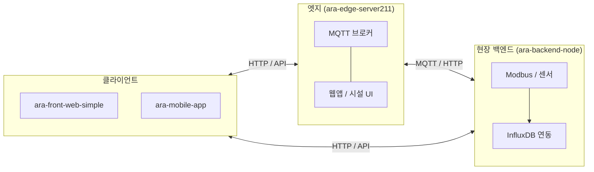

# ARA Platform — 프로젝트 개요 (Meta)

이 저장소내의 ARA Platform 프레임웍은 시설원예연구소의 오픈 플랫폼을 기반으로 제작되었고 각종 앱, 양액기 및 환경제어 등은 코리아디지탈의 고유 제품입니다. 

[araplatformkd](https://github.com/araplatformkd) 조직의 **ARA(시설·온실 자동화) 플랫폼** 관련 저장소들의 역할, 관계, 권장 설치 순서를 한곳에서 안내합니다.  
코드 본문은 각 하위 저장소에 있으며, 이 저장소는 **문서·내비게이션** 용도입니다.

각 저장소의 자세한 내용은 각 저장소의 [README.md](http://README.md) 파일에 자세히 설명되어져 있습니다. 

---

## 설치 및 유지보수 관련 주의점
1. 백엔드 / 프런트엔드 의 `dist/` 폴더는 현장설치 디바이스의 백엔드/프런트엔드에 자동업데이트 설정이 되어져 있습니다(주의!!!). 
  - 프런트앱의 [pi-auto-update-dist.js](https://github.com/araplatformkd/ara-front-web-simple/tree/main/tools) 파일은 디바이스에 설치되어져 pm2 process 로 자동 실행됩니다.  
  - (레거시 저장소 `ara-front-web`은 **사용하지 마세요.**)
  - 동일한 파일에서 백엔드/프런트엔드 앱이 각각의 설정으로 업데이트 합니다. 
2. 백엔드 시스템의 설정파일(필수)은 디바이스에 설치되어져 있습니다. 
  - `./config/indoor-config.json` 자동운전 / 핀맵 / 센서맵 등의 설정파일 
  - `./config.js` : 모드버스통신을 위한 설정파일 
3. 디바이스의 OS는 **SD Card Copier** 앱을 활용합니다.

---

## 저장소 맵


| 저장소                                                                           | 설명                                                                                                   |
| ----------------------------------------------------------------------------- | ---------------------------------------------------------------------------------------------------- |
| **[ara-overview](https://github.com/araplatformkd/ara-overview)**             | ( 이 저장소 / Public ) 전체 구조·연동·시작 가이드                                                                   |
| **[ara-edge-server211](https://github.com/araplatformkd/ara-edge-server211)** | **AG Edge Server** — 온실·시설용 엣지(Node.js). HTTP·정적 리소스·MQTT 브로커·웹앱 레지스트리·시설 관리(`ag.system.facility`) 등 |
| **[ara-backend-node](https://github.com/araplatformkd/ara-backend-node)**     | **현장 백엔드** — Raspberry Pi 등에서 동작하는 Node.js 기반 실내/온실 자동화(MQTT·Modbus·InfluxDB·Express 등)              |
| **[ara-front-web-simple](https://github.com/araplatformkd/ara-front-web-simple)** | **웹 관리자·대시보드** 프론트엔드(현장 터치·모니터링 UI 등). **이 경로를 사용하세요.** |
| ~~**[ara-front-web](https://github.com/araplatformkd/ara-front-web)**~~           | ~~레거시~~ — **신규·유지보수에 사용하지 않음** (장비에 오토업데이트중) |
| **[ara-mobile-app](https://github.com/araplatformkd/ara-mobile-app)**         | **모바일 앱** — Flutter 기반(WebView·Cordova 대체 마이그레이션 등)                                                  |
| **[ara-documents](https://github.com/araplatformkd/ara-document)**            | **추가중** —모노레포·부가 프로젝트 묶음·자료·문서·외부협업문서 등                                                              |


> 일부 저장소는 비공개(Private)일 수 있습니다. 접근이 필요하면 조직 관리자에게 권한을 요청하세요.

---

## 아키텍처와 데이터 흐름 (요약)

ARA는 **엣지(현장 게이트웨이)** 와 **온실/실내 제어 노드(Pi 등)** , **운영자용 웹·모바일** 로 나뉩니다. 제품·현장 구성에 따라 아래 모든 컴포넌트를 동시에 쓰지 않을 수 있습니다.




- **ara-edge-server211**: 시설 단위 **플랫폼 코어**. 웹앱을 등록·실행하고, MQTT로 장비·서비스를 묶습니다. `workspace/` 아래 앱(예: 시설 관리, 제어기·양액기 연동, CCTV 등)이 동작합니다.
- **ara-backend-node**: **개별 온실/실내 노드**에서 센서·구동기·자동운전·시계열 저장을 담당하는 백엔드입니다. Influx·MQTT 시뮬레이터 등이 포함됩니다.
- **ara-front-web-simple**: 웹앱으로 제작된 실시간 모니터링·환경설정용 프런트엔드입니다. **`ara-front-web`은 사용하지 마세요(레거시).**  
- **ara-mobile-app**: 
  - 운영자·관리자가 상태를 보고 설정하는 **UI 계층**입니다. 실제 연결 URL·API는 배포 환경(엣지 IP, 도메인, 리버스 프록시)에 맞춥니다.
  - **Cordova / Flutter WebView** 를 활용하여 안드로이드앱을 제작후 Google Firebase Storage 를 통해 앱업데이트 연동되어 있습니다.

---

## 권장 설치·실행 순서

처음 온보딩할 때는 **한 저장소만** 필요할 수도 있습니다. 아래는 “전 스택을 로컬에서 이해할 때”의 권장 순서입니다.

### 1. 문서 읽기

1. 이 `ara-overview` README로 전체 그림을 잡습니다.
2. 사용할 저장소의 **자체 README**를 읽습니다(엣지는 `install.md`, 백엔드는 `README.md`의 요구 사항·엔트리 포인트).

### 2. ara-edge-server211 (엣지 플랫폼)

- **역할**: 현장 PC·산업용 PC·일부 임베디드에서 AG Edge Server 실행.
- **시작점**: 저장소 루트 `README.md`의 “Git 클론 후 바로 실행”, `install.md`(Node/Python·빌드 도구).
- **설정**: `config.json`(HTTP/MQTT 포트, `workspace` 경로 등).

※ ./workspace 폴더에는 개발소스 전체가 포함되어져 있습니다. "개발 > .tar > 클라우드 업로드 > 사용자다운로드 > 설치" 순서로 앱은 설치가 됩니다   

```bash
git clone https://github.com/araplatformkd/ara-edge-server211.git
cd ara-edge-server211
# install.md 기준으로 Node 등 설치 후
npm install
npm start
```
### 3. ara-backend-node (온실·실내 노드)
- **포함**: 양액기와 환경제어 두시스템 모두 동일한 백엔드를 사용합니다. 
  - 해당시스템의 MQTT topic 에 따라 재시작시 적용됩니다. 
  - "/home/pi/kd/indoor/config.js 내에 정의되어진 토픽키가 "../IRRIGATION/..." 이면 양액기로 작동, "../SWITCHGEAR/..." 이면 환경제어로 작동됩니다.
- **역할**: Pi 등에서 `indexIndoorV2.js` 중심으로 MQTT·Modbus·Influx·웹을 구동.
- **요구**: Node.js **22.x** 권장(저장소 `.nvmrc` / Volta 기준).
- **빌드**: `npm install` 후 `npm run build`로 `dist/` 생성·배포.

```bash
git clone https://github.com/araplatformkd/ara-backend-node.git
cd ara-backend-node
npm install
# 개발/시뮬: README의 simulator 스크립트 참고
# 운영: indexIndoorV2.js 및 config/indoor-config.json 등 현장 설정
# 개발환경 실행시 npm run dev 
# 빌드환경 npm run build


# ./dist 폴더는 디바이스에 자동업데이트 됩니다. (자동/정지 설정가능)
# 현재 백엔드 프로그램 자동업데이트 설정은 "정지" 입니다 
```

### 4. ara-front-web-simple (웹)

- **권장 저장소입니다.** `ara-front-web`은 레거시이며 **새 작업·배포에 사용하지 마세요.**
- 저장소 README·`package.json` 스크립트에 따라 의존성 설치 및 개발 서버 실행.
- **백엔드/엣지 주소**는 환경 변수 또는 설정 파일로 맞춥니다(팀 표준 따름).

```bash
git clone https://github.com/araplatformkd/ara-front-web-simple.git
cd ara-front-web-simple
npm install

# 개발환경 실행시 npm run dev 
# 빌드환경 npm run build

# ./dist 폴더는 디바이스에 자동업데이트 됩니다. (자동/정지 설정가능)
```

### 5. ara-mobile-app (Cordova / Flutter)

- `./app-flutter/`(또는 저장소 구조에 맞는 경로)에서 Flutter SDK로 빌드.
- `./app-cordova/`(또는 저장소 구조에 맞는 경로)에서 Corodva SDK로 빌드.
- 웹뷰·API 엔드포인트는 제품 빌드 설정에 따릅니다.

```bash
git clone https://github.com/araplatformkd/ara-mobile-app.git
cd ara-mobile-app
npm install


# 개발환경 실행시(웹앱 개발시)
npm run dev 

# 빌드환경 - 안드로이드앱 빌드 절차 
npm run build
- webpack으로 빌드후 ./dist 폴더 생성 
- post-build.js 로 ./dist내 정적 웹앱을 ./distWebapp(웹브라우저용)으로 복사 

npm run cordova:copy
- ./dist → ./app-cordova/www

cd cordova-app
npm run release
- app-debug.apk 파일 생성 

# 빌드환경 npm run build

```

## **Cordova / Flutter 같은 점**

1. **웹 소스는 동일**

- 저장소 **루트**에서 npm run build → dist/ 생성 (Cordova와 동일).

1. **앱 안에 보이는 버전**

- WebView 안 UI는 여전히 **src/js/app-version.js** 를 쓰므로, 사용자에게 맞출 거면 Cordova와 **같이** 올려 주는 게 좋습니다.

## **다른 점 (Flutter 전용)**


| 항목      | Cordova                                               | Flutter                                                            |
| ------- | ----------------------------------------------------- | ------------------------------------------------------------------ |
| 웹 복사    | npm run cordova:copy → app-cordova/www/               | app-flutter\scripts\copy_web_assets.ps1 → assets/www/              |
| 네이티브 빌드 | npx cordova build android (+ --release)               | flutter build apk --release (또는 AAB)                               |
| 네이티브 버전 | app-cordova/config.xml (version, android-versionCode) | pubspec.yaml + android/app/build.gradle의 versionCode / versionName |
| 서명      | Cordova build.json 등                                  | Android 쪽 [key.properties](http://key.properties) / Gradle 서명 설정   |
| 배포 스크립트 | app-cordova/scripts/firebase-uploader.js 등            | 프로젝트에 맞게 별도 (Flutter 산출 경로가 다름)                                    |


## **Flutter 릴리스 순서 (요약)**

1. (권장) **src/js/app-version.js** 와 맞추고, **Flutter/Android 버전**도 pubspec.yaml·build.gradle에서 정리.
2. **루트**에서 npm run build.
3. cd app-flutter → .\scripts\copy_web_assets.ps1 (또는 build_apk.ps1이 1~3을 묶어 줌).
4. flutter build apk --release (릴리스 서명은 Android 설정에 따라).
5. 산출물: 대략 app-flutter\build\app\outputs\flutter-apk\app-release.apk.

정리하면, **“npm run build로 웹 만들기 + 버전 의미 맞추기”는 같고**, **복사 경로·빌드 명령·버전/서명 파일은 Flutter 전용 절차**를 따르면 됩니다.

---

## 로컬 디렉터리 예시 (여러 저장소를 나란히 둘 때)

```text
클론폴더/
├── ara-overview/           # 이 메타 저장소
├── ara-documents/          # 각종 문서 및 기술자료(저장소 만들예정)
├── ara-edge-server211/     # 아라플랫폼 프레임워크
├── ara-backend-node/       # 디바이스 백엔드 프로그램
├── ara-front-web-simple/   # 디바이스 모니터링 터치 프로그램 (권장)
└── ara-mobile-app/         # 디바이스 설정/제어 모바일앱
```

각 저장소는 **독립 Git 저장소**로 클론하는 것을 권장합니다(서브모듈은 팀 합의 후).

---

## 이슈·기여

- **버그·기능 요청**: 해당 기능이 속한 **원 저장소**의 Issues에 등록하는 것이 가장 빠릅니다.
- **문서 오류**(이 overview만의 문제): [ara-overview Issues](https://github.com/araplatformkd/ara-overview/issues)에 남겨 주세요.
- **기여**: 대상 저장소의 README·브랜치 정책을 따르고, 커밋 메시지는 변경 요약이 한눈에 들어오게 작성합니다.

---

## 라이선스

이 저장소(`ara-overview`)의 문서는 저장소 루트 `LICENSE`를 따릅니다.  
**각 하위 저장소는 자체 LICENSE**가 있을 수 있으므로 재배포·상용 이용 전 반드시 해당 저장소의 라이선스를 확인하세요.