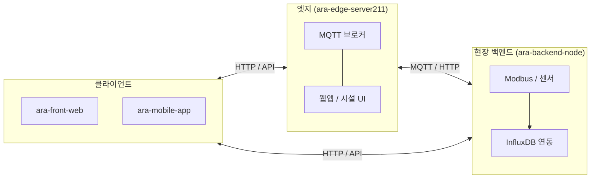

# ARA Platform — 프로젝트 개요 (Meta)

[araplatformkd](https://github.com/araplatformkd) 조직의 **ARA(시설·온실 자동화) 플랫폼** 관련 저장소들의 역할, 관계, 권장 설치 순서를 한곳에서 안내합니다.  
코드 본문은 각 하위 저장소에 있으며, 이 저장소는 **문서·내비게이션** 용도입니다.

> **조직 방문자에게 먼저 보이게 하기:** [github.com/araplatformkd](https://github.com/araplatformkd) **Overview**에는 이 레포의 `README.md`가 아니라, 공개 저장소 [araplatformkd/.github](https://github.com/araplatformkd/.github)의 [profile/README.md](https://github.com/araplatformkd/.github/blob/main/profile/README.md)만 최상단에 렌더링됩니다.

### 이 README만 수정해서 조직 홈에 올리는 방법

| 방식 | 할 일 |
|------|--------|
| **자동 (권장)** | 아래 [GitHub Actions 동기화](#github-actions로-조직-profile-자동-반영)를 한 번만 설정해 두면, 이 파일(`README.md`)을 `master`/`main`에 push할 때마다 `.github/profile/README.md`가 같이 갱신됩니다. |
| **수동** | [araplatformkd/.github](https://github.com/araplatformkd/.github)에서 `profile/README.md`를 이 파일과 동일하게 고친 뒤 커밋·푸시합니다. |

**저장소 카드(Pinned / Popular)** 가 Overview에 보이게 하려면 GitHub가 자동으로만 채워 주지 않고, 조직 **Owner**가 아래처럼 **Pin**을 해야 합니다.

1. [github.com/araplatformkd](https://github.com/araplatformkd) → **Overview** 탭
2. 오른쪽 **View as** → **Public** 선택(비회원이 보는 화면과 동일하게 맞춤)
3. 오른쪽 사이드바에서 **Pin repositories** 또는 **Customize pins** 클릭
4. **ara-overview**(및 필요 시 다른 공개 저장소) 선택 후 저장

자세한 설명: [Pinning repositories to your organization's profile](https://docs.github.com/en/organizations/collaborating-with-groups-in-organizations/customizing-your-organizations-profile#pinning-repositories-to-your-organizations-profile).

---

## GitHub Actions로 조직 profile 자동 반영

`README.md`만 고쳐서 [조직 Overview](https://github.com/araplatformkd)에 반영하려면, 이 저장소의 워크플로가 [araplatformkd/.github](https://github.com/araplatformkd/.github)의 `profile/README.md`를 덮어씁니다.

1. **토큰 만들기** (조직/저장소에 쓸 수 있는 계정으로 로그인)  
   - **Fine-grained PAT** (권장): 대상 조직 `araplatformkd` → 저장소 **`.github`만** 선택 → **Contents: Read and write**  
   - 또는 **Classic PAT**: `repo` 범위 (범위가 더 넓음)
2. [**ara-overview** → Settings → Secrets and variables → Actions](https://github.com/araplatformkd/ara-overview/settings/secrets/actions) → **New repository secret**  
   - Name: `ORG_PROFILE_SYNC_PAT`  
   - Value: 위에서 만든 토큰
3. `master` 또는 `main`에 `README.md`를 **push**하면 워크플로 **Sync org profile README**가 실행됩니다.  
   - 필요 시 [Actions 탭](https://github.com/araplatformkd/ara-overview/actions)에서 **Run workflow**로 수동 실행할 수 있습니다.

토큰을 넣기 전에는 **수동**으로 `.github`의 `profile/README.md`를 맞춰 두어야 조직 홈 문구가 바뀝니다.

---

## 저장소 맵


| 저장소                                                                           | 설명                                                                                                   |
| ----------------------------------------------------------------------------- | ---------------------------------------------------------------------------------------------------- |
| **[ara-overview](https://github.com/araplatformkd/ara-overview)**             | (이 저장소) 전체 구조·연동·시작 가이드                                                                              |
| **[ara-edge-server211](https://github.com/araplatformkd/ara-edge-server211)** | **AG Edge Server** — 온실·시설용 엣지(Node.js). HTTP·정적 리소스·MQTT 브로커·웹앱 레지스트리·시설 관리(`ag.system.facility`) 등 |
| **[ara-backend-node](https://github.com/araplatformkd/ara-backend-node)**     | **현장 백엔드** — Raspberry Pi 등에서 동작하는 Node.js 기반 실내/온실 자동화(MQTT·Modbus·InfluxDB·Express 등)              |
| **[ara-front-web](https://github.com/araplatformkd/ara-front-web)**           | **웹 관리자·대시보드** 프론트엔드(AdminLTE 기반 UI 등)                                                               |
| **[ara-mobile-app](https://github.com/araplatformkd/ara-mobile-app)**         | **모바일 앱** — Flutter 기반(WebView·Cordova 대체 마이그레이션 등)                                                  |
| **[ara-system](https://github.com/araplatformkd/ara-system)**                 | (선택) 모노레포·부가 프로젝트 묶음 — 팀 정책에 따라 소규모 웹·테스트 자산                                                         |


> 일부 저장소는 비공개(Private)일 수 있습니다. 접근이 필요하면 조직 관리자에게 권한을 요청하세요.

---

## 아키텍처와 데이터 흐름 (요약)

ARA는 **엣지(현장 게이트웨이)** 와 **온실/실내 제어 노드(Pi 등)** , **운영자용 웹·모바일** 로 나뉩니다. 제품·현장 구성에 따라 아래 모든 컴포넌트를 동시에 쓰지 않을 수 있습니다.




- **ara-edge-server211**: 시설 단위 **플랫폼 코어**. 웹앱을 등록·실행하고, MQTT로 장비·서비스를 묶습니다. `workspace/` 아래 앱(예: 시설 관리, 제어기·양액기 연동, CCTV 등)이 동작합니다.
- **ara-backend-node**: **개별 온실/실내 노드**에서 센서·구동기·자동운전·시계열 저장을 담당하는 백엔드입니다. Influx·MQTT 시뮬레이터 등이 포함됩니다.
- **ara-front-web** : 웹앱으로 제작되어 졌으며 실시간 모니터링 및 환경설정 앱입니다.  
- **ara-mobile-app**: 
  - 운영자·관리자가 상태를 보고 설정하는 **UI 계층**입니다. 실제 연결 URL·API는 배포 환경(엣지 IP, 도메인, 리버스 프록시)에 맞춥니다.
  - Cordova WebView 를 활용하여 안드로이드앱을 제작하여 Google Firebase Storage 를 통해 앱업데이트 연동되어져 있습니다. 
  - Flutter WebViewe 를 활용하여 제작된 안드로이드 앱. (현재 이 앱은 서비스 되고 있지 않음).
  - 테스트 

---

## 권장 설치·실행 순서

처음 온보딩할 때는 **한 저장소만** 필요할 수도 있습니다. 아래는 “전 스택을 로컬에서 이해할 때”의 권장 순서입니다.

### 1. 문서 읽기

1. 이 `ara-overview` README로 전체 그림을 잡습니다.
2. 사용할 저장소의 **자체 README**를 읽습니다(엣지는 `install.md`, 백엔드는 `README.md`의 요구 사항·엔트리 포인트).

### 2. ara-edge-server211 (엣지 플랫폼)

- **역할**: 현장 PC·산업용 PC·일부 임베디드에서 AG Edge Server 실행.
- **시작점**: 저장소 루트 `README.md`의 “Git 클론 후 바로 실행”, `install.md`(Node/Python·빌드 도구).
- **설정**: `config.json`(HTTP/MQTT 포트, `workspace` 경로 등).

```bash
git clone https://github.com/araplatformkd/ara-edge-server211.git
cd ara-edge-server211
# install.md 기준으로 Node 등 설치 후
npm install
npm start
```

### 3. ara-backend-node (온실·실내 노드)

- **역할**: Pi 등에서 `indexIndoorV2.js` 중심으로 MQTT·Modbus·Influx·웹을 구동.
- **요구**: Node.js **22.x** 권장(저장소 `.nvmrc` / Volta 기준).
- **빌드**: `npm install` 후 `npm run build`로 `dist/` 생성·배포.

```bash
git clone https://github.com/araplatformkd/ara-backend-node.git
cd ara-backend-node
npm install
# 개발/시뮬: README의 simulator 스크립트 참고
# 운영: indexIndoorV2.js 및 config/indoor-config.json 등 현장 설정
```

### 4. ara-front-web (웹)

- 저장소 README·`package.json` 스크립트에 따라 의존성 설치 및 개발 서버 실행.
- **백엔드/엣지 주소**는 환경 변수 또는 설정 파일로 맞춥니다(팀 표준 따름).

### 5. ara-mobile-app (Flutter)

- `app-flutter/`(또는 저장소 구조에 맞는 경로)에서 Flutter SDK로 빌드.
- 웹뷰·API 엔드포인트는 제품 빌드 설정에 따릅니다.

---

## 로컬 디렉터리 예시 (여러 저장소를 나란히 둘 때)

```text
DEV_ARA/
├── ara-overview/          # 이 메타 저장소
├── ara-edge-server211/
├── ara-backend-node/
├── ara-front-web/
└── ara-mobile-app/
```

각 저장소는 **독립 Git 저장소**로 클론하는 것을 권장합니다(서브모듈은 팀 합의 후).

---

## 이슈·기여

- **버그·기능 요청**: 해당 기능이 속한 **원 저장소**의 Issues에 등록하는 것이 가장 빠릅니다.
- **문서 오류**(이 overview만의 문제): [ara-overview Issues](https://github.com/araplatformkd/ara-overview/issues)에 남겨 주세요.
- **기여**: 대상 저장소의 README·브랜치 정책을 따르고, 커밋 메시지는 변경 요약이 한눈에 들어오게 작성합니다.

---

## 라이선스

이 저장소(`ara-overview`)의 문서는 저장소 루트 `LICENSE`를 따릅니다.  
**각 하위 저장소는 자체 LICENSE**가 있을 수 있으므로 재배포·상용 이용 전 반드시 해당 저장소의 라이선스를 확인하세요.